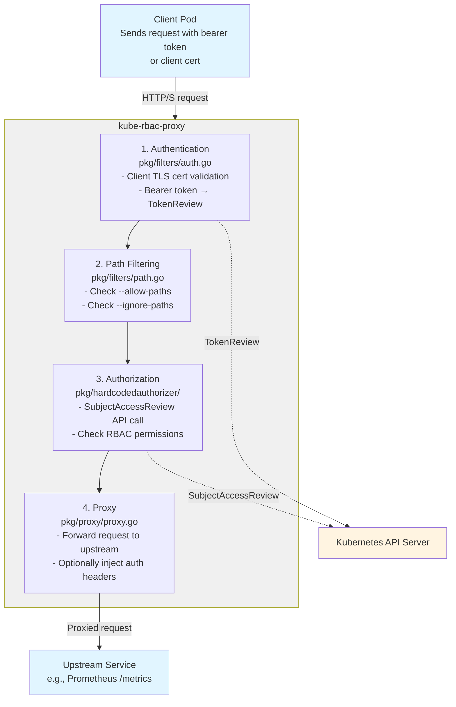

# Architecture: kube-rbac-proxy

This document describes the internal architecture, key design decisions, and important tradeoffs in kube-rbac-proxy.

## Overview

kube-rbac-proxy is a lightweight HTTP(S) reverse proxy that enforces Kubernetes RBAC authorization for a single upstream service. It solves the problem of pods being able to access other pods' endpoints simply because they share a network, even when those pods should not have permission to access the data.

## Core Design Principles

1. **Single Upstream**: One kube-rbac-proxy instance protects exactly one upstream. This keeps the configuration simple and the security boundary clear.

2. **Kubernetes-Native Authorization**: Leverage Kubernetes' existing RBAC system rather than implementing a separate authorization mechanism. Every request is validated against the Kubernetes API server.

3. **Defense in Depth**: Even in clusters without NetworkPolicies, or for HostNetwork pods where NetworkPolicies don't apply, we can enforce access control.

4. **Sidecar Pattern**: Designed to run as a sidecar container alongside the service being protected.

## Architecture Diagram

## Component Details

### Authentication (`pkg/filters/auth.go`)

**Purpose**: Identify who is making the request.

**Methods**:
1. **Client TLS Certificate**: If `--client-ca-file` is set, validate the client's certificate against the CA and extract the CommonName as the username.
2. **Bearer Token**: Extract token from `Authorization: Bearer <token>` header, then call Kubernetes `TokenReview` API to validate and extract user information.
3. **OIDC Token**: If `--oidc-issuer` is set, validate JWT tokens directly against the OIDC provider.

**Key Decision**: Support multiple authentication methods to accommodate different use cases (service accounts, user tokens, external OIDC).

**Tradeoff**: Token-based auth allows the upstream to impersonate the client (see security note in README). mTLS is preferred for production.

### Path Filtering (`pkg/filters/path.go`)

**Purpose**: Allow or block requests based on URL path before performing expensive authorization checks.

**Modes**:
- `--allow-paths`: Whitelist - only listed paths are allowed
- `--ignore-paths`: Paths that bypass authorization entirely (use with caution)

**Key Decision**: Pattern matching rather than exact string matching for flexibility.

**Tradeoff**: `--ignore-paths` reduces security but may be needed for health checks or other non-sensitive endpoints.

### Authorization (`pkg/hardcodedauthorizer/`)

**Purpose**: Determine if the authenticated user has permission to access the upstream.

**Mechanism**: 
- Construct a `SubjectAccessReview` based on configuration file (`--config-file`)
- Send to Kubernetes API server
- API server evaluates against RBAC policies
- Allow or deny based on result

**Configuration File Options**:
- `resourceAttributes`: Check if user can perform an action on a Kubernetes resource (e.g., `GET pods`)
- `nonResourceAttributes`: Check if user can access a non-resource URL (e.g., `/metrics`)
- `rewrites`: Dynamically rewrite SubjectAccessReview based on request parameters

**Key Decision**: Delegate authorization logic to Kubernetes rather than reimplementing it. This ensures consistency with cluster-wide RBAC policies.

**Tradeoff**: Every request requires an API call to the Kubernetes API server, adding latency and load. However, this is necessary to ensure real-time authorization against current RBAC policies.

### Proxy (`pkg/proxy/proxy.go`)

**Purpose**: Forward authorized requests to the upstream service.

**Features**:
- HTTP/1.1 and HTTP/2 support
- h2c (HTTP/2 cleartext) for upstreams like gRPC servers without TLS
- Client certificate authentication to upstream (`--upstream-client-cert-file`)
- Custom CA for upstream TLS verification (`--upstream-ca-file`)
- Optional auth header injection (`--auth-header-fields-enabled`) to pass user/group info to upstream

**Key Decision**: Support multiple HTTP protocols to accommodate diverse upstreams (REST APIs, gRPC, metrics endpoints).

**Tradeoff**: h2c and insecure modes exist for compatibility but are being deprecated in favor of secure-by-default behavior.

### TLS Management (`pkg/tls/`)

**Purpose**: Handle TLS certificates for the proxy's listen socket and automatic reloading.

**Features**:
- TLS certificate reloading at intervals (`--tls-reload-interval`, deprecated)
- Support for custom cipher suites (`--tls-cipher-suites`)
- Minimum TLS version enforcement (`--tls-min-version`, default TLS 1.2)

**Key Decision**: Auto-reload certificates to support certificate rotation without restarting the proxy.

**Status**: `--tls-reload-interval` is deprecated; future versions will use filesystem watches instead of polling.

## Key Design Decisions

### Why a Sidecar Instead of a Cluster-Wide Proxy?

**Decision**: kube-rbac-proxy is designed as a per-pod sidecar rather than a cluster-wide ingress proxy.

**Rationale**:
- **Least privilege**: Each proxy instance only knows about one upstream, limiting blast radius of a compromise
- **No single point of failure**: Cluster-wide proxies become bottlenecks and single points of failure
- **Simpler configuration**: One proxy = one upstream = one config file
- **Better security isolation**: Proxy runs in the same pod as the upstream, sharing its security context and network namespace

**Tradeoff**: More resource overhead (one proxy per protected service) vs. security and reliability.

### Why Use Kubernetes API for Every Request?

**Decision**: Perform `SubjectAccessReview` against the Kubernetes API for every incoming request.

**Rationale**:
- **Real-time authorization**: RBAC policies can change at any time; checking on every request ensures current policies are enforced
- **No caching of authz decisions**: Cached authorization decisions could become stale and allow unauthorized access after RBAC policies are updated
- **Consistency**: Using the same authorization mechanism as the rest of Kubernetes ensures behavior is predictable

**Tradeoff**: Higher latency and increased load on the Kubernetes API server. This is acceptable for our use case (protecting metrics and other low-throughput endpoints) but might not scale for high-throughput services.

**Mitigation**: Clients can configure `--kube-api-qps` and `--kube-api-burst` to tune API client rate limiting.

### Why Not Use NetworkPolicies Instead?

**Question**: Why not just use Kubernetes NetworkPolicies to restrict access?

**Reasons kube-rbac-proxy is Still Needed**:
1. **Not all clusters support NetworkPolicies**: Some network plugins don't implement them
2. **HostNetwork pods**: NetworkPolicies don't apply to pods with `hostNetwork: true`, which is common for monitoring components like node-exporter
3. **User-level authorization**: NetworkPolicies are pod-to-pod; kube-rbac-proxy can enforce user-level RBAC (e.g., "only users in the `metrics-readers` group can access this")
4. **Defense in depth**: Even with NetworkPolicies, having an additional layer of authorization reduces attack surface

**Relationship**: kube-rbac-proxy complements NetworkPolicies; they solve related but different problems.

### Why Single Upstream?

**Decision**: Each kube-rbac-proxy instance protects exactly one upstream.

**Rationale**:
- **Simpler configuration**: No routing rules, no multiplexing logic
- **Clear security boundary**: One proxy = one authorization policy
- **Sidecar model**: Designed to run alongside a single service in a pod

**Alternative Considered**: A multi-upstream proxy with routing rules (similar to Envoy).

**Tradeoff**: More proxy instances and resource overhead, but simpler security model and clearer failure domains.

## Integration Points

### Kubernetes API Server

- **TokenReview**: Validates bearer tokens and returns user information
- **SubjectAccessReview**: Evaluates authorization decisions against RBAC policies
- **Client-go**: Uses standard Kubernetes client libraries for API interaction

### OIDC Providers (Optional)

- **JWT Validation**: Can validate OIDC tokens directly without calling Kubernetes TokenReview
- **User/Group Extraction**: Extracts username and groups from JWT claims (`--oidc-username-claim`, `--oidc-groups-claim`)

### Upstream Services

- **HTTP/1.1, HTTP/2, h2c**: Supports multiple protocols
- **TLS or Cleartext**: Can connect to TLS or non-TLS upstreams
- **Client Certificates**: Can authenticate to upstreams using client certs

## Performance Considerations

### Latency

- Each request incurs at least one Kubernetes API call (SubjectAccessReview)
- For bearer tokens, an additional API call (TokenReview) is required
- Typical latency overhead: 10-50ms depending on Kubernetes API server load

**Acceptable Use Cases**: Metrics endpoints, health checks, admin APIs - low-throughput, latency-tolerant

**Not Recommended For**: High-throughput application APIs where every millisecond matters

### Kubernetes API Load

- Each request = at least 1 SubjectAccessReview API call
- High request rate = high load on Kubernetes API server

**Mitigation**:
- Designed for low-throughput use cases (metrics collection, etc.)
- Users can tune rate limiting with `--kube-api-qps` and `--kube-api-burst`

## Security Considerations

### Token Security

**Risk**: If the upstream is compromised, it can use captured bearer tokens to impersonate clients.

**Mitigation**: 
- Prefer mTLS authentication (`--client-ca-file`) over bearer tokens
- Only use bearer token auth when upstream is already higher-privileged than the token
- Document this risk clearly (see README)

### TLS Configuration

**Defaults**:
- Minimum TLS 1.2 (`--tls-min-version`)
- Modern cipher suites (Go defaults unless overridden)
- No insecure mode in future versions (deprecating `--insecure-listen-address`)

### Attack Surface

**Reduced Surface**:
- Proxy only forwards to one upstream (no routing complexity to exploit)
- All requests are authenticated and authorized before forwarding
- No dynamic configuration or admin API (smaller attack surface)

## Future Direction

### Upstream Project Direction

**Note**: The upstream kube-rbac-proxy project (brancz/kube-rbac-proxy) is working toward becoming an official Kubernetes project under SIG Auth. This OpenShift fork tracks relevant upstream changes while maintaining OpenShift-specific requirements.

Upstream changes being tracked:
- **Removing insecure modes**: Deprecating `--insecure-listen-address` and similar flags
- **Aligning with Kubernetes logging**: Removing deprecated logging flags
- **Tighter integration with Kubernetes code**: Using more upstream Kubernetes libraries

### OpenShift Fork Deprecations

- `--insecure-listen-address`: Insecure HTTP listener (following upstream deprecation)
- `--tls-reload-interval`: Polling-based cert reload (moving to filesystem watches)
- Certain logging flags: Aligning with Kubernetes standard logging

## Testing Strategy

### Unit Tests

- Located in `*_test.go` files alongside implementation
- Cover individual components: auth filters, path filters, proxy logic
- Run quickly without external dependencies

### E2E Tests

- Located in `test/e2e/`
- Run in a real kind cluster
- Validate end-to-end flows:
  - Token authentication and authorization
  - Client certificate authentication
  - OIDC authentication
  - HTTP/2 and h2c support
  - Config file rewrites

**Key Testing Insight**: E2E tests in a real cluster are essential because this project's core value is Kubernetes API integration. Unit tests can't fully validate SubjectAccessReview behavior.

## Related Projects

### Envoy / Istio

**Differentiation**: 
- kube-rbac-proxy: Kubernetes RBAC-specific authorization
- Envoy/Istio: General-purpose service mesh with many features beyond RBAC

**Complementary**: It's valid to use Envoy as the ingress point to a pod, which then forwards to kube-rbac-proxy, which forwards to the application.

### Kubernetes API Server Proxy

**Differentiation**: The Kubernetes API server has built-in proxy functionality, but:
- kube-rbac-proxy offloads the API server (doesn't add to its request load)
- kube-rbac-proxy can be used as a sidecar to protect any service, not just API server endpoints
- kube-rbac-proxy validates incoming requests, not just proxying based on existing authentication

## References

- [README.md](README.md) - User-facing documentation
- [CONTRIBUTING.md](CONTRIBUTING.md) - Development workflow
- [AGENTS.md](AGENTS.md) - AI agent guidance
- [examples/](examples/) - Working examples demonstrating configuration patterns
